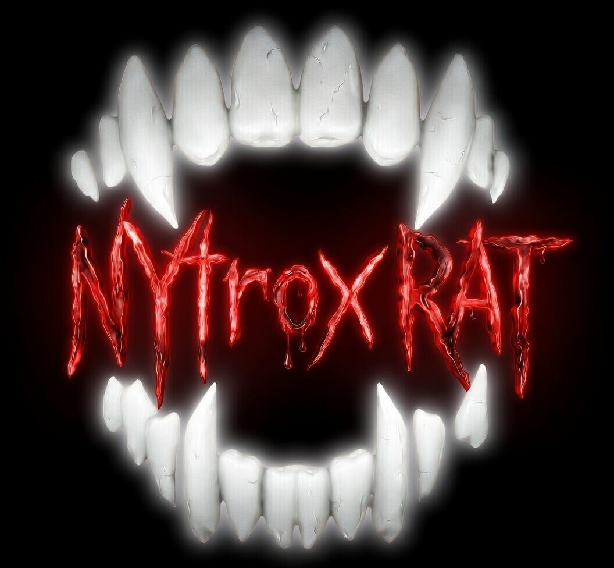

<p align="center">
  
</p>
⚠️ Disclaimer: This tool is for educational and ethical purposes only; the developer assumes no liability for any misuse or damage. 🛡️
# NytroxRAT

A self-hosted, open-source remote access tool for Windows written in C# (.NET 9).

## Features

| Feature | Description |
|---|---|
| 🖥 Screen sharing | Live JPEG stream with adjustable quality & FPS |
| 🖱 Remote input | Mouse move/click + keyboard forwarding |
| 📁 File manager | Browse, upload, download, delete files |
| 💻 Terminal | Execute commands, streaming output |
| 📊 Monitoring | CPU, RAM, disk, uptime, process list |
| 🔐 Encryption | AES-256-GCM end-to-end (server never sees plaintext) |
| 🔄 Relay server | Works through NAT & firewalls — no port forwarding needed |
| 📸 Webcam | webcam can be acsessed and be seen live with the ability to take snapshots |

---

## Architecture

```
[Admin Client (WPF)]  ←──WebSocket──→  [Relay Server (ASP.NET Core)]  ←──WebSocket──→  [Agent (Windows)]
        │                                         │                                              │
   MainWindow.xaml                        RelayRouter.cs                              AgentClient.cs
   ServerConnection.cs                    SessionManager.cs                           ScreenCaptureService.cs
                                                                                      InputService.cs
                                                                                      FileService.cs
                                                                                      CommandService.cs
                                                                                      MonitoringService.cs
```

All traffic is **end-to-end encrypted** with AES-256-GCM. The relay server only routes raw encrypted bytes — it cannot read your session data.

---

## Project Structure

```
NytroxRAT/
├── Shared/                     # Shared packet models + crypto
│   ├── Models/Packets.cs
│   └── Crypto/PacketCrypto.cs
├── Server/                     # ASP.NET Core relay server
│   ├── Program.cs
│   ├── RelayRouter.cs
│   ├── SessionManager.cs
│   └── appsettings.json
├── Agent/                      # Windows background agent
│   ├── Program.cs
│   ├── AgentClient.cs
│   ├── appsettings.json
│   └── Services/
│       ├── ScreenCaptureService.cs
│       ├── InputService.cs
│       ├── FileService.cs
│       ├── CommandService.cs
│       └── MonitoringService.cs
└── Client/                     # WPF admin UI
    ├── App.xaml / App.xaml.cs
    ├── MainWindow.xaml
    ├── MainWindow.xaml.cs
    └── ServerConnection.cs
```

---

## Quick Start

### Prerequisites
- [.NET 9 SDK](https://dotnet.microsoft.com/download/dotnet/9)
- Windows (Agent & Client are Windows-only; Server runs cross-platform)

### 1. Set a shared secret

Edit `appsettings.json` in both **Server** and **Agent**, replacing `changeme-in-production` with a strong secret. Use the same value in the Client UI when connecting.

### 2. Run the Relay Server

```bash
cd Server
dotnet run
# Listening on http://0.0.0.0:5000
```

For production, put it behind nginx/Caddy with TLS (wss://).

### 3. Run the Agent (on the remote machine)

```bash
cd Agent
dotnet run
# Or publish as single-file EXE:
dotnet publish -c Release -r win-x64 --self-contained -p:PublishSingleFile=true
```

Configure `appsettings.json` or use environment variables:
```
RAGENT_RelayUrl=ws://your-server:5000
RAGENT_AgentId=PC-OFFICE-01
RAGENT_SharedSecret=your-secret-here
```

### 4. Run the Admin Client

```bash
cd Client
dotnet run
```

Enter the relay URL, the agent's ID, and the shared secret — then click **Connect**.

---

## Configuration Reference

### Agent (`appsettings.json` or env vars prefixed `RAGENT_`)

| Key | Default | Description |
|---|---|---|
| `RelayUrl` | `ws://localhost:5000` | WebSocket URL of relay server |
| `AgentId` | Machine hostname | Unique ID for this agent |
| `SharedSecret` | `changeme` | Must match server + client |

### Server (`appsettings.json` or env var)

| Key | Default | Description |
|---|---|---|
| `AGENT_SECRET` | `changeme` | Secret agents must present to register |
| `Urls` | `http://0.0.0.0:5000` | Bind address |

---

## Security Notes

- **Change the shared secret** before any real use. The default is not safe.
- In production, run the relay server behind **HTTPS/WSS** (nginx + Let's Encrypt).
- The relay server is a **dumb pipe** — packets are AES-256-GCM encrypted between agent and client using a key derived from the shared secret (PBKDF2, 100k iterations).
- The file delete operation is **non-recursive** by default — it won't delete non-empty folders.
- File downloads are capped at **50 MB**.
- Consider adding **agent allow-listing** (only accept connections from known client IPs) for extra hardening.

---

## Running as a Windows Service (Agent)

```bash
# Install as service
sc create RemoteAgent binPath= "C:\path\to\NytroxRAT.Agent.exe"
sc start RemoteAgent
```

Or use the `Microsoft.Extensions.Hosting.WindowsServices` NuGet package for a proper service host with graceful shutdown.

---

## Roadmap / Open Source Ideas

- [ ] Multi-monitor support
- [ ] Clipboard sync
- [ ] Session recording / audit log
- [ ] TLS certificate pinning
- [ ] Web-based admin client (Blazor)
- [ ] Multi-agent dashboard
- [ ] Role-based access control
- [ ] macOS/Linux agent (cross-platform screen capture)

---

## License

MIT — free to use, modify, and distribute.
